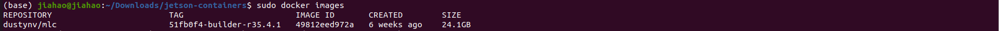
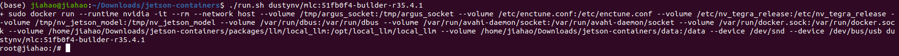
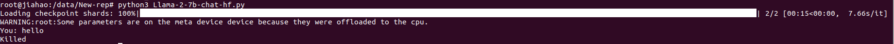
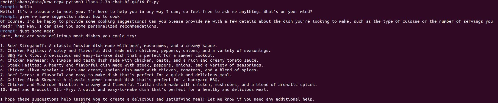

# Llama with MLC on Jetson Orin NX 16GB

## Pareper environment
```shell
sudo apt-get update && sudo apt-get install git python3-pip
```
```shell
git clone --depth=1 https://github.com/dusty-nv/jetson-containers
```
```shell
cd jetson-containers pip3 install -r requirements.txt
```
```shell 
cd ./data git clone https://github.com/LJ-Hao/MLC-LLM-on-Jetson-Nano.git cd ..
```
## Install and run contiainer

### first step: install image
```shell
./run.sh --env HUGGINGFACE_TOKEN=<YOUR-ACCESS-TOKEN> $(./autotag mlc) /bin/bash -c 'ln -s $(huggingface-downloader meta-llama/Llama-2-7b-chat-hf) /data/models/mlc/dist/models/Llama-2-7b-chat-hf'
```
use ```sudo docker images``` to check wether the image is installed or not
    

### second step: Install Llama2-7b-chat-hf and Use MLC quantify the model
```shell
./run.sh $(./autotag mlc) \
python3 -m mlc_llm.build \
--model Llama-2-7b-chat-hf \
--quantization q4f16_ft \
--artifact-path /data/models/mlc/dist \
--max-seq-len 4096 \
--target cuda \
--use-cuda-graph \
--use-flash-attn-mqa
```
### thrid step: Run and enter docker
```shell
./run.sh <YOUR IMAGE NAME> 
#for me dustynv/mlc:51fb0f4-builder-r35.4.1 check result of first step
```


## Run Llama with MLC
### first : run Llama without quanifing with MCL 

```shell
cd /data/MLC-LLM-on-Jetson python3 Llama-2-7b-chat-hf.py 
```
here is the result:

you can see without quanifing with MLC, Jetson Nano 16GB can load the model but cant not run

### second : run Llama with quanifing with MCL
```shell
cd /data/MLC-LLM-on-Jetson python3 Llama-2-7b-chat-hf-q4f16_ft.py 
```
here is the result:

you can see with quanifing with MLC, Jetson Nano 16GB can run
## Video of running Llama with MLC on Jetson Orin NX 16GB:
 
 comming soon
